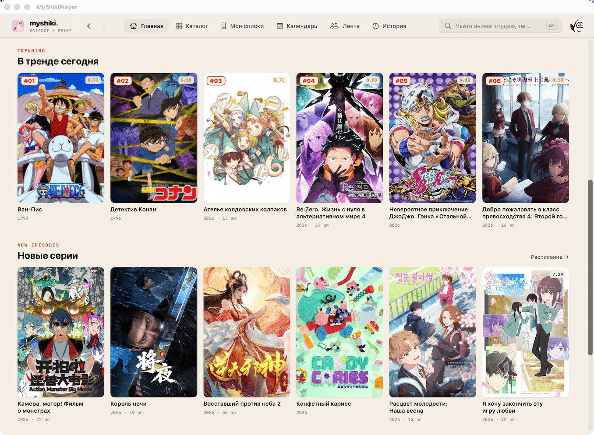

# MyShikiPlayer

Нативное macOS-приложение для просмотра аниме через [Shikimori](https://shikimori.one) и [Kodik](https://kodik.cc). Написано на Swift / SwiftUI.



## Возможности

- **OAuth-вход через Shikimori** с автоматическим обновлением токена.
- **Каталог, поиск, фильтры** по году, жанру, типу, рейтингу, статусу.
- **Личная библиотека**: статусы просмотра, оценки, прогресс по эпизодам — синхронизация с Shikimori.
- **История просмотра**.
- **Встроенный плеер** на `AVPlayer` через Kodik, с выбором студии озвучки, авто-resume и пропуском опенинга.
- **Социальный блок**: лента активности друзей, топики, комментарии (в зачаточном состоянии, но в планах доработка, пока приложение не получило одобрение на полноценный доступ).
- **Темы** (светлая / тёмная / системная).
- **Кастомные домены** для Shikimori и Kodik прямо из Settings — на случай блокировки или зеркал.

## Требования

- macOS 14 (Sonoma) или новее
- Xcode 16 или новее (Swift 5.10+, file-system synchronized groups)
- Аккаунт разработчика Shikimori для получения OAuth `client_id` / `client_secret`
- Токен Kodik `/search` API (выдаётся партнёрам сервиса)

## Установка из исходников

```bash
git clone https://github.com/korenskoy/MyShikiPlayer.git
cd MyShikiPlayer
```

### 1. Настроить секреты

Создать `Configuration/Secrets.xcconfig` из примера:

```bash
cp Configuration/Secrets.example.xcconfig Configuration/Secrets.xcconfig
```

Заполнить:

```
SHIKIMORI_CLIENT_ID = <ваш OAuth client_id>
SHIKIMORI_CLIENT_SECRET = <ваш OAuth client_secret>
SHIKIMORI_REDIRECT_URI = myshikiplayer:/$()/oauth
KODIK_API_TOKEN = <ваш токен Kodik>
```

OAuth-приложение регистрируется в [личном кабинете Shikimori](https://shikimori.one/oauth/applications). В поле `Redirect URI` указать `myshikiplayer://oauth` (схема описана в `Configuration/OAuthURLTypes.plist`). Запрашиваемые scope: `user_rates topics comments`.

### 2. (Опционально) Подпись для локальной сборки

```bash
cp Configuration/Local.example.xcconfig Configuration/Local.xcconfig
# Указать DEVELOPMENT_TEAM = <ваш Apple Team ID> либо оставить пустым для "Sign to Run Locally"
```

### 3. Собрать и запустить

```bash
xed MyShikiPlayer.xcodeproj
# Запуск Cmd+R в Xcode
```

или из CLI:

```bash
xcodebuild -project MyShikiPlayer.xcodeproj \
  -scheme MyShikiPlayer \
  -configuration Debug \
  -destination 'platform=macOS' build
```

### 4. Сборка релизного DMG

```bash
./scripts/build-dmg.sh
```

Скрипт инкрементит `CURRENT_PROJECT_VERSION` в `Configuration/Version.xcconfig`, делает Release-сборку и упаковывает подписанный DMG в `build/`.

## Структура проекта

```
MyShikiPlayer/
├── Shikimori/         # API/auth-клиенты (REST, GraphQL, OAuth, retry, конфигурация)
├── Sources/KodikSdk/  # Kodik /search клиент, /ftor резолвер, классификация ошибок
├── Sources/           # Адаптеры провайдеров и SourceRegistry с auto-fallback
├── Player/            # AVPlayer engine, координаторы prefetch/resume/stream
├── AnimeDetails/      # Страница тайтла, эпизоды, выбор студии, скриншоты
├── Library/           # Список тайтлов, фильтрация, пагинация, кэш на диск
├── Catalog/, Home/, Explore/, History/, Profile/, Social/, Settings/, Filters/
├── Repositories/      # Слой кэширования (TTL + дисковые JSON-бэкапы)
├── Progress/          # WatchProgressStore + WatchHistoryStore
├── DesignSystem/      # Темы, цвета, типография, общие компоненты
└── UI/, AppShell/     # Навигация, окно, тулбар, оверлеи

Configuration/         # xcconfig-файлы (хосты, версии, секреты)
scripts/               # lint.sh, build-dmg.sh
MyShikiPlayerTests/    # XCTest (юнит + декодинг + HTTP-моки)
MyShikiPlayerUITests/  # UI smoke + launch performance
```

## Архитектура

- **Многослойность**: API → Repositories → ViewModels (фасады) → SwiftUI views.
- **Координаторы плеера**: `PrefetchCoordinator`, `ResumeCoordinator`, `StreamSelector` вынесены из `PlaybackSession`, который остаётся фасадом для UI-стабильности.
- **Авторизация**: `ShikimoriAuthController` хранит сессию в Keychain. На 401/403 от refresh не чистит хранилище — выставляет `requiresReauth`, UI показывает баннер. Только явный `signOut()` очищает сессию.
- **Кэши**: `PersonalCacheCleaner.purge()` дропает все персональные данные (history, library, profile, social) при `requiresReauth` и `signOut()`. Kodik-токен и UI-настройки сохраняются.
- **Ошибки источников**: `KodikSourceError {auth, banned, transient(status:), parse, network}` маппится в `PlayerError`. Транзиентные ошибки ретраятся через `RetryPolicy.withRateLimitRetry` (exponential backoff). При наличии резервных адаптеров `SourceRegistry.resolveWithFallback` пробует следующий провайдер.
- **Кастомные хосты**: `ShikimoriHostsStore` и `KodikConfiguration` берут оверрайды из `UserDefaults` (Settings → «Домены»), дефолты приходят из xcconfig.

## Roadmap

Ниже — направления, в которых проект развивается. Без жёстких сроков, в порядке приоритета внутри каждой группы.

### Социальные функции (форумы, лента, комментарии)

- **Создание и редактирование комментариев** к тайтлам и в топиках. OAuth-scope `comments` уже запрашивается, осталось довести UI и API-обвязку.
- **Голоса (votes/likes)** за комментарии и топики через `/api/v2/abuse_requests` и `/votes`.
- **Картинки в комментариях** (`[image=N]`-тег BBCode): парсинг и inline-рендер вложений из `html_body`. Сейчас сырой тег попадает в текст без отрисовки.
- **Спойлеры и цитаты** — свой рендер `[spoiler]` и `[quote]` (collapsible, с подсветкой), вместо текущего fallback на `html_body`.
- **Топики на странице тайтла** — список обсуждений конкретного аниме (отдельный таб в `AnimeDetailsView`), переход в `TopicDetailView`.
- **Создание новых топиков** (если scope позволит) и подписка на обновления.
- **Лента активности**: фильтры по типу события (rates / комментарии / друзья), бесконечная прокрутка, отметка прочитанного.
- **Уведомления Shikimori** (личные сообщения, ответы) — отдельный счётчик в тулбаре.

### Источники видео и плеер

- **Полноценные резервные адаптеры** (Anilibria / Anime365 и др.) поверх готовой `SourceRegistry.resolveWithFallback` — сейчас инфраструктура есть, рабочих адаптеров нет.
- **Skip ending** в дополнение к skip opening — `KodikVideoLinksResolver` пока не парсит end-range.
- **Уважение `Retry-After`** в `RetryPolicy` для Shikimori и Kodik (сейчас фиксированный exponential backoff).
- **Выбор качества по умолчанию** в Settings (1080p / auto / экономия трафика).

### Архитектура и технический долг

- **Миграция на `@Observable`** (Swift 5.9+ / macOS 14+).
- **Декомпозиция `PlaybackSession`** глубже — выделить `PlayerErrorRouter` и `StudioSwitcher` (после стабилизации текущих координаторов).
- **Тесты на сетевой слой** через `MockURLProtocol`: 401/403/429/451 для Kodik и Shikimori, refresh-flow, fallback между адаптерами.
- **CI** (GitHub Actions) с матрицей `xcodebuild build` + `test` + `swiftlint` на каждый PR.

### UX

- **Локализация** (`en` в дополнение к `ru`).
- **Поиск с подсказками** в каталоге (`/api/animes/autocomplete`).
- **Клавиатурные шорткаты** для плеера и навигации (полный список в Settings).

## Тесты и линтер

```bash
xcodebuild test -project MyShikiPlayer.xcodeproj \
  -scheme MyShikiPlayer \
  -destination 'platform=macOS'

./scripts/lint.sh        # проверка
./scripts/lint.sh --fix  # авто-фикс
```

## Дисклеймер

Это **неофициальный** клиент. Проект не аффилирован с Shikimori, Kodik или какими-либо правообладателями. Используются публичные API сервисов. Контент предоставляется самими сервисами; приложение лишь отображает то, что они отдают по своим протоколам. Используйте на свой риск и в соответствии с условиями сервисов.

## Благодарности

- [Shikimori](https://shikimori.one) — каталог, OAuth и социальные функции.
- [Kodik](https://kodik.cc) — источник видео.

## Лицензия

[MIT](LICENSE)
